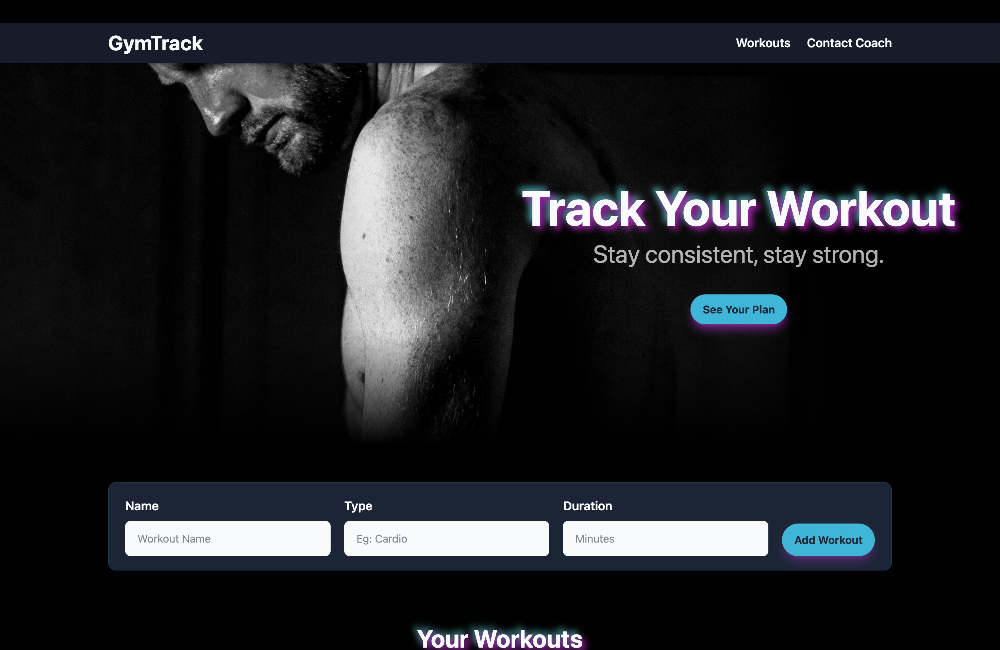
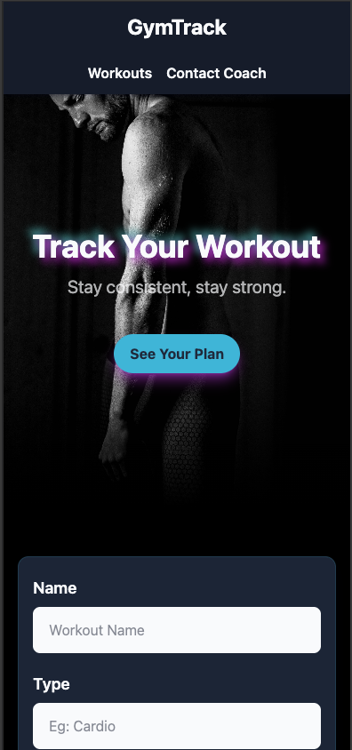
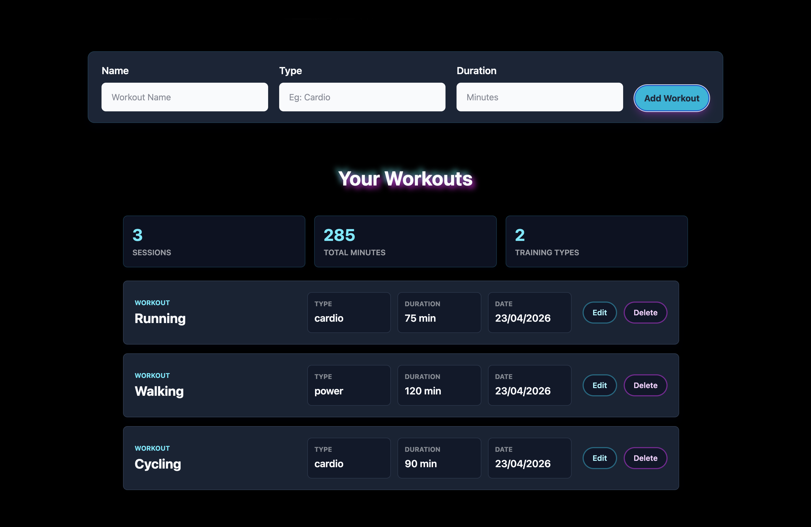
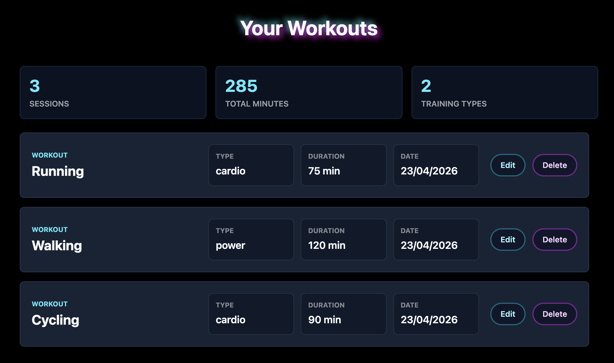

# 💪 GymTrack

Track your workouts, stay consistent, and build momentum.

👉 **Live demo:** https://gym-track-fitness.netlify.app

---

## 🚀 About the project

GymTrack is a simple and clean workout tracking web app built with **Vanilla JavaScript**.
It allows users to manage their workouts with full CRUD functionality and a smooth user experience.

This project focuses on:

- Structuring JavaScript in a modular way
- Managing state without frameworks
- Building reusable UI components
- Creating a polished and responsive UI

---

## ✨ Features

- ➕ Add workouts (name, type, duration, date)
- 📋 View all workouts
- ✏️ Update existing workouts
- 🗑️ Delete workouts
- 💾 Persistent storage using **localStorage**
- 📊 Basic stats (sessions, total minutes, training types)
- 🎯 Empty state handling
- 📱 Fully responsive design

---

## 🛠️ Tech stack

- **HTML5**
- **CSS3** (custom styling, responsive design)
- **Vanilla JavaScript (ES Modules)**
- **Vite** (build tool)
- **Netlify** (deployment)

---

## 🧠 What I learned

- Managing application state without frameworks
- Building reusable UI components in plain JavaScript
- Handling form data and events cleanly
- Working with localStorage for persistence
- Debugging real-world issues (type mismatches, events, build vs dev differences)
- Structuring a small frontend app in a scalable way

---

## 📁 Project structure

```
src/
│
├── js/
│   ├── components/     # Reusable UI components (form, button, list, etc.)
│   ├── services/       # UI rendering & persistence logic
│   └── app.js          # Main state & handlers
│
├── css/
│   └── style.css       # Styling
│
└── index.html
```

---

## ⚙️ Installation & usage

Clone the repository:

```bash
git clone https://github.com/Bennyam/gymtrack.git
cd gymtrack
```

Install dependencies:

```bash
npm install
```

Run development server:

```bash
npm run dev
```

Build for production:

```bash
npm run build
```

Preview production build:

```bash
npm run preview
```

---

## 🌍 Deployment

The project is deployed using **Netlify**:
👉 https://gym-track-fitness.netlify.app

---

## 🔮 Future improvements

- Filter and search workouts
- Better input validation
- Category selection (dropdown instead of text input)
- Animations and micro-interactions
- Backend integration (API instead of localStorage)
- Authentication

---

## 📸 Screenshots

### 🖥️ Desktop



### 📱 Mobile



### ➕ Add Workout



### 📊 Dashboard / Stats



---

## 🙌 Author

**Ben Ameryckx**

---

## 📄 License

This project is open-source and available under the MIT License.
